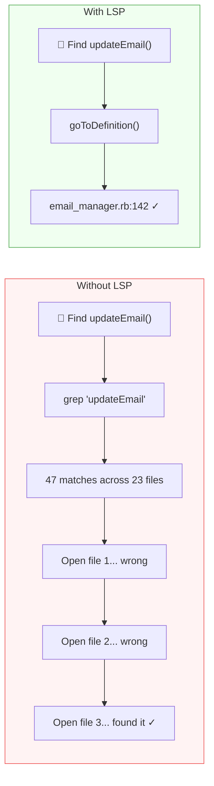

**TL;DR:** I ran identical coding tasks with and without [language servers](https://microsoft.github.io/language-server-protocol/) enabled in [GitHub Copilot CLI](https://docs.github.com/en/copilot/github-copilot-in-the-cli). In a large Ruby monolith (~118k files), LSP made Copilot **3–4x faster** for models that completed the task - and one model couldn't finish at all without it. In a small Python repo (61 files), it made no difference. If you work in large or complex codebases, LSP is worth the 10-minute setup. If your repos are small and well-organized, you can skip it.

---

I was setting up [GitHub Copilot CLI](https://docs.github.com/en/copilot/github-copilot-in-the-cli) with [MCP servers](https://modelcontextprotocol.io/) to accelerate my workflow when I kept seeing references to "LSP servers" in the configuration docs. Great - another acronym I knew nothing about.

After getting over the initial "do I really need to learn what this is too?" feeling, I decided to actually figure out what value language servers could bring to my developer experience. Rather than just installing them and hoping for the best, I designed an experiment.

## What is a language server?

A [language server](https://microsoft.github.io/language-server-protocol/) is a background process that understands your code the same way your IDE does. It knows where functions are defined, what calls what, what type a variable is, and how symbols relate to each other across files. It speaks a standardized protocol ([LSP](https://microsoft.github.io/language-server-protocol/specifications/lsp/3.17/specification/)) so any tool can ask it questions.

When Copilot CLI has access to a language server, it can ask "where is this function defined?" or "what references this variable?" and get an instant, precise answer. Without one, it falls back to grep - scanning files with text patterns and hoping the results are relevant.

Think of it like the difference between asking a librarian where a book is versus wandering the stacks reading spine labels.



## Why this matters for AI coding assistants

Every time an AI assistant searches your codebase, it makes a **tool call** - a discrete interaction where the model invokes a tool like file search, file read, or code edit, then waits for the result before deciding what to do next. A broad grep in a large repo might return dozens of false positives, each requiring another tool call to inspect and discard. Those wasted calls add up in wall-clock time you're sitting there waiting.

A language server eliminates that fumbling. In large repos where search is expensive, fewer tool calls translates directly to faster completion.

## The experiment

I picked two real tasks I'd already completed - one in a large Ruby monolith, one in a small Python repo. For each, I reintroduced the original bug on separate branches and let Copilot CLI fix it: once with language servers enabled (LSP-ON), once without (LSP-OFF). Same prompt, same starting state, same task.

To check whether the benefit depends on the AI model, I repeated each test across three models: **Claude Sonnet 4.6**, **Claude Opus 4.7**, and **GPT-5.4**. That's 12 total runs (2 repos × 2 conditions × 3 models). I measured both tool call count and wall-clock time for each run.

**Methodology notes:** Each run started from a clean branch with the bug reintroduced. LSP-ON agents were instructed to use LSP tools ([goToDefinition](https://microsoft.github.io/language-server-protocol/specifications/lsp/3.17/specification/#textDocument_definition), [findReferences](https://microsoft.github.io/language-server-protocol/specifications/lsp/3.17/specification/#textDocument_references), etc.) as their primary navigation method. LSP-OFF agents were explicitly instructed not to use any LSP tools - I verified in the tool call logs that no LSP operations were invoked in those runs. Tests were not executed during runs to avoid confounding the timing data. Each condition was run once per model, so these are single-run measurements. The consistent pattern across three independent models helps compensate, but treat individual numbers as directional rather than precise.

I also validated each run's output by diffing the resulting commits against the known correct fix to confirm the changes were correct.

## Test 1: Ruby monolith (~118,000 tracked files)

The task: update a contact email address across 4 locations in a large Ruby on Rails monolith. Straightforward find-and-replace, but the repo has ~118,000 tracked files (roughly 51,000 Ruby source files alone), dynamically typed, and full of similarly-named methods.

| Model | LSP-ON | LSP-OFF | Speedup |
|-------|--------|---------|---------|
| Claude Sonnet 4.6 | 12 calls, **103s** | 18 calls, 331s | **3.2x faster** |
| Claude Opus 4.7 | 8 calls, **65s** | 12 calls, 1,272s ❌ | **task failed without LSP** |
| GPT-5.4 | 11 calls, **69s** | 42 calls, 303s | **4.4x faster** |

With LSP, every model found all four locations and made the fix in about a minute. Without LSP, models needed 2–4x more tool calls to search through the massive codebase. GPT without LSP made 42 tool calls - nearly 4x more than with LSP - as it scanned directories and grep results trying to narrow down the right files.

The most striking result: **Opus without LSP couldn't even complete the task.** It spent over 21 minutes searching, navigating through similarly-named files and test fixtures, and eventually concluded the email had already been changed - it hadn't. The model appears to have found a test expectation containing the target string and mistook it for evidence the change was done. Without semantic navigation in a repo that large, the model got lost in the noise.


*\*Opus -LSP (DNF) failed to complete the task correctly despite spending 1,272 seconds searching*

## Test 2: Python action repo (61 files)

The task: refactor a `get_contributors()` function from an N+1 API call pattern to a commits-first approach across 4 files in the [contributors](https://github.com/github-community-projects/contributors) GitHub Action. This is a more complex refactoring task than the Ruby find-and-replace, but in a small, well-organized Python repo with 61 files total.

| Model | LSP-ON | LSP-OFF | Difference |
|-------|--------|---------|------------|
| Claude Sonnet 4.6 | 57 calls, 667s | ¹, 247s | LSP slower (outlier) |
| Claude Opus 4.7 | 18 calls, 1,310s | 17 calls, 1,292s | no meaningful difference |
| GPT-5.4 | 22 calls, 209s | 38 calls, 194s | no meaningful difference |

¹ *Sonnet LSP-OFF did not report its tool call count in the agent summary. All other metrics were captured normally.*

**No consistent benefit.** In a small, well-structured repo, both conditions performed similarly. The Sonnet LSP-ON result (667s) appears to be an outlier where the agent took a convoluted path unrelated to LSP. Across the other models, times showed no meaningful difference.

This makes sense. With only 61 files and clear module boundaries, grep finds the right file on the first try. There's nothing for LSP to shortcut.


## When LSP helped, and when it didn't

The pattern is consistent across all three models: **LSP's value scales with the size and complexity of your codebase.**

In the Ruby monolith, LSP turned a 5-minute search-and-pray into a 1-minute precision strike - every single time, regardless of model. In the small Python repo, both approaches performed equally because the codebase was small enough that brute-force search worked fine.

It's worth noting that the two tasks also differed in complexity - the Ruby task was a straightforward find-and-replace while the Python task was a multi-file refactor. So repo size isn't the only variable. That said, the direction is clear: LSP's advantage comes from eliminating expensive search operations, and those only pile up in large codebases.

**LSP matters most when:**
- The repo is large and sprawling (thousands of files)
- The language is dynamically typed (names are ambiguous without runtime context)
- The task requires tracing references across many modules
- Method and file names are duplicated or overloaded

**LSP matters less when:**
- The repo is small with clear module boundaries
- File structure makes the target obvious from the path alone
- The language has explicit imports that grep can follow
- The bug is well-localized to a known component

## Tradeoffs

LSP isn't free. Each language server runs as a background process - in my experience, they consume roughly 100–300MB of RAM each depending on the language and project size. Server quality varies by language - [gopls](https://github.com/golang/tools/tree/master/gopls) and [typescript-language-server](https://github.com/typescript-language-server/typescript-language-server) are excellent, while some newer servers can be flaky. Startup time adds a few seconds to the first query in each session. And you're adding another dependency to maintain and update.

For most developers, the tradeoff is worth it if you regularly work in repos with more than a few hundred files. If all your repos are small and well-organized, the overhead likely outweighs the benefit.

## How to set it up

### Step 1: Figure out what languages you use most

You probably already know this intuitively, but it helps to check. From your main project directories, count files by extension:

```bash
find ~/projects -type f -not -path '*/.git/*' | sed 's/.*\.//' | sort | uniq -c | sort -rn | head -10
```

Focus on your top 3–5 languages. Those are where LSP will have the most impact, especially if any of them are dynamically typed.

### Step 2: Find language servers

Most popular languages have well-maintained LSP implementations:

| Language | Server | Install command |
|----------|--------|----------------|
| Python | [python-lsp-server](https://github.com/python-lsp/python-lsp-server) | `pip install python-lsp-server` |
| TypeScript/JavaScript | [typescript-language-server](https://github.com/typescript-language-server/typescript-language-server) | `npm install -g typescript-language-server typescript` |
| Go | [gopls](https://github.com/golang/tools/tree/master/gopls) | `go install golang.org/x/tools/gopls@latest` |
| Ruby | [ruby-lsp](https://github.com/Shopify/ruby-lsp) | `gem install ruby-lsp` |
| Rust | [rust-analyzer](https://rust-analyzer.github.io/) | `rustup component add rust-analyzer` |
| C/C++ | [clangd](https://clangd.llvm.org/) | `brew install llvm` or your package manager |
| Shell/Bash | [bash-language-server](https://github.com/bash-lsp/bash-language-server) | `npm install -g bash-language-server` |

Search "[your language] language server" if yours isn't listed - nearly every language has one.

### Step 3: Install and configure

Install the servers for your top languages, then create `~/.copilot/lsp-config.json` to tell Copilot CLI where to find them:

```json
{
  "lspServers": {
    "python": {
      "command": "pylsp",
      "args": [],
      "fileExtensions": {
        ".py": "python"
      }
    },
    "typescript": {
      "command": "typescript-language-server",
      "args": ["--stdio"],
      "fileExtensions": {
        ".ts": "typescript",
        ".tsx": "typescriptreact",
        ".js": "javascript",
        ".jsx": "javascriptreact"
      }
    }
  }
}
```

The `command` is whatever binary you installed. The `args` vary by server (most use `--stdio`). The `fileExtensions` map tells Copilot which file extensions to route to that server, with the value being the language identifier.

Run `/lsp` in Copilot CLI to confirm they're detected and healthy.

## Try it yourself

The best way to know if LSP helps *your* workflow is to test it. Pick a task you've already done in a large repo, reintroduce the problem on a branch, and run Copilot CLI with and without LSP. Count the tool calls and time it. The numbers tell the story better than any blog post can.

If you try this, I'd love to hear what you find - [drop me a note](https://github.com/zkoppert) or share your results. I'm curious whether the pattern holds across other languages and codebase sizes.

---

*Built with [GitHub Copilot CLI](https://docs.github.com/en/copilot/github-copilot-in-the-cli). The experiments, analysis, and even most of this blog post were produced collaboratively with Copilot in my terminal.*


