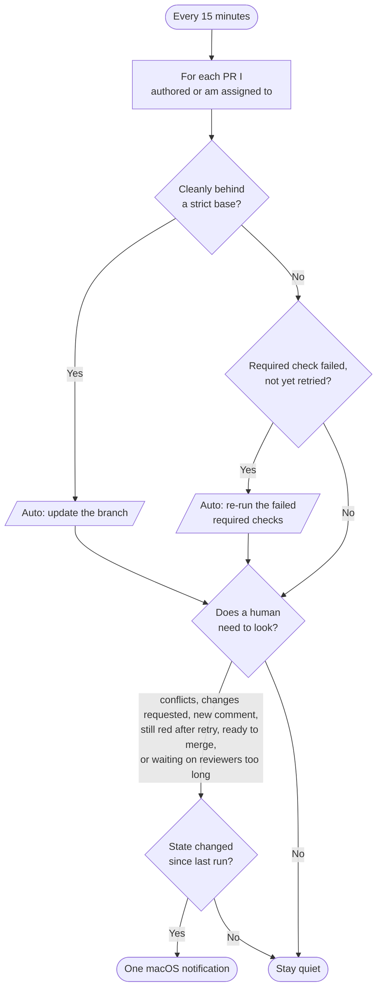

## TL;DR

Babysitting an open pull request is a pile of tiny chores: re-running a flaky required check, keeping the branch current when the base moves, noticing a reviewer left a comment, and knowing when it's ready to merge. I built a small, dependency-free tool called [`babysit-prs`](https://github.com/zkoppert/babysit-prs) that does the mechanical parts on a schedule and only sends me a mac notification when a PR actually needs a human. It helps me be responsive without having to constantly dig through my notifications. It runs every 15 minutes from `launchd` and stays quiet until something changes.

## The problem: shepherding is a tax

I go through my day sometimes feeling like there are so many plates to keep spinning (or PRs with so many spinners, haha). I would open a PR, then switch to another project while waiting for ci, waiting for review, waiting for copilot feedback, etc. etc. You can imagine what my browser tab counts are. 😅 So I built this list of projects and PRs and keep cycling through them looking for an opportunity to move it one step further. It's not my favorite part of my day and feels like friction and a brain-bending amount of context switching.

The more I automate things the worse this problem seems to get because I can have more things running on their own until they need me to help move them forward. Essentially, when you can open more PRs, you have more of them to shepherd, and the bottleneck shifts from writing the change to babysitting it through the pipeline. So because I'm slightly crazy, I made my automation-caused problem better with more automation! 😜

## What it does

`babysit-prs` looks at your recently-active open pull requests, the ones you authored or are assigned to, and does three things.

- **It re-runs failed required checks**, once per commit. A flaky required check gets one automatic retry. If it is still red after that, the tool tells you, because now it is probably not flaky.
- **It updates a stale branch** when the base requires up-to-date branches and the PR is cleanly behind, so CI re-runs against the latest base without you clicking anything.
- **It notifies you only when a human is needed**: merge conflicts, changes requested, a new review comment (including the Copilot reviewer's, since those usually need a response, while noisy bots like Dependabot stay filtered out), a branch update that failed, a required check still red after the retry, a PR that is green and ready to merge, or a PR that has sat waiting on reviewers for a few days and needs a nudge.

Everything else, it handles silently. The auto-actions (re-running checks, updating branches) only touch PRs you authored, since those are your branches to push. On PRs you are just assigned to, it stays hands-off and only alerts.

Here is the whole loop, top to bottom. The left side is what the machine handles on its own; the right side is the short list of things that actually earn an interruption, and even those are gated by "did anything change since last time?"



Note that the auto-actions on the left only run on PRs I authored; assigned PRs skip straight to the "does a human need to look?" gate.

## Guardrails, on purpose

The auto-actions are deliberately timid, because a tool that touches your PRs unattended has to earn trust.

- It only ever re-runs **required** checks. If it cannot read which checks are required, it does nothing to CI rather than guessing.
- It only updates a branch when the base is **strict** and the branch is cleanly **behind**, and it never tries to resolve a merge conflict for you. A conflict is always a "come look at this."
- Anything ambiguous is left for you. The tool would rather under-act and tell you than over-act and surprise you.

## How to use it

You need the [`gh` CLI](https://cli.github.com/) authenticated with `repo` and `workflow` scopes, macOS for the notifications, and Python 3.11 or newer. There is nothing to `pip install`; the tool is standard library only.

```bash
brew install gh terminal-notifier
gh auth login
git clone https://github.com/zkoppert/babysit-prs.git ~/repos/babysit-prs
```

See what it would do without changing anything:

```bash
python3 ~/repos/babysit-prs/babysit_prs.py --dry-run --verbose
```

Then wire it into `launchd` so it runs every 15 minutes or whatever you'd like. The repo ships example `launchd` and wrapper templates in [`examples/`](https://github.com/zkoppert/babysit-prs/tree/main/examples) so you only have to edit a couple of paths. If you use the [GitHub Copilot CLI](https://github.com/github/copilot-cli), there is a `SKILL.md` so you can just ask it to "babysit my PRs."

With [`terminal-notifier`](https://github.com/julienXX/terminal-notifier) installed, each notification is clickable and opens the PR. Without it, the tool falls back to a plain notification with the URL in the body so you can still copy it.

## Tradeoffs

A few things worth knowing before you adopt it.

- Notifications are macOS only today. The scheduling and the GitHub work are portable, but the notifier is not yet.
- To catch inline review-thread replies, the tool makes an extra API call per PR. On a couple of dozen active PRs that is a few seconds of runtime, comfortably inside a 15-minute cadence, but it is not free.
- It watches only your own PRs, the ones you authored or are assigned to. It is a personal assistant, not a team-wide bot.

## Hoping this calms my context switching and maybe yours too

If you have ever alt-tabbed back to a PR just to check whether CI finished, this is for you. Clone [`babysit-prs`](https://github.com/zkoppert/babysit-prs), run it in `--dry-run` for a day to see what it would have done, and then let it hold the boring half of PR shepherding for you. Issues and pull requests are welcome!!
