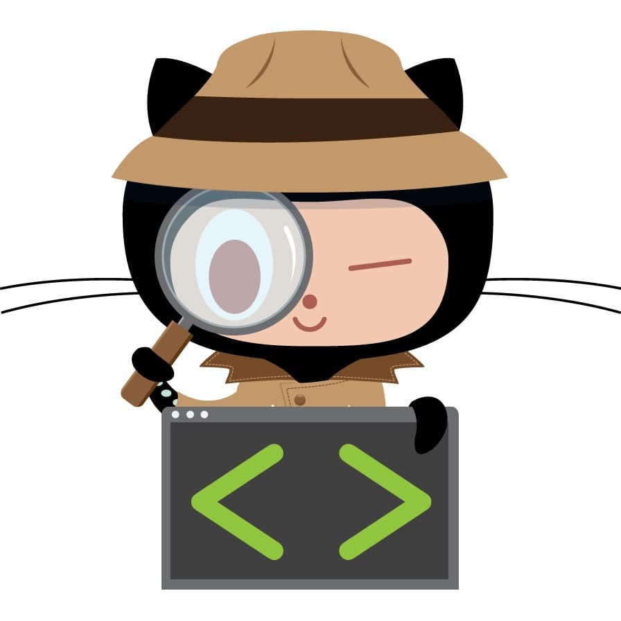

# Catching Merge Conflicts Before They Catch You

*March 13, 2026*

We were three engineering teams at GitHub, all jumping into the same product space at the same time. Multiple concurrent work streams, tight timelines, and a shared codebase. Everything was moving fast - until the 11th hour, when we discovered that the work we'd each been doing was stepping on each other's toes. The resulting merge conflicts caused days of rework. Not hours. Days.

If you've ever been deep into a feature branch, confident in your progress, only to discover that someone across the org has been modifying the same files in the same lines - you know the sinking feeling. It's not just a technical problem. It's a coordination problem. And in our case, it was a coordination problem hiding in plain sight across 1,500 open pull requests spread across two massive repositories that nearly the whole company works in.

That experience is why I built the [PR Conflict Detector](https://github.com/github-community-projects/pr-conflict-detector).

## The problem with merge conflicts

Merge conflicts are inevitable in any codebase with active development. But there's a big difference between a conflict you know about and one that blindsides you at the worst possible moment.

The traditional approach to dealing with merge conflicts is reactive: you find out about them when you try to merge. By then, both authors have invested significant time building on top of diverging code. The fix is no longer a quick resolution - it's a rework exercise where someone has to untangle two independently developed features that were never meant to coexist in their current form.

What we needed was a way to detect these conflicts early - ideally as soon as two PRs start touching the same lines of code. Not when one of them tries to merge, but while both are still in progress and the authors still have time to coordinate. This works well at GitHub since we push draft pull requests early for visibility.

## What the PR Conflict Detector does

The PR Conflict Detector is a GitHub Action that proactively scans open pull requests across your organization and identifies pairs of PRs that are modifying overlapping lines in the same files. It's designed to work at scale - we use it at GitHub on repositories with over a thousand open PRs - and it supports scanning an entire organization, a single repository, or a specific list of repositories.

Here's how it works:

1. **Scans all open PRs** (including drafts by default) and fetches their changed files and line ranges
2. **Groups PRs by file** - if two PRs aren't touching any of the same files, there's no reason to compare them
3. **Checks for line-level overlap** - file-level overlap isn't enough. Two PRs can modify the same file without conflicting. The tool checks whether the actual line ranges intersect.
4. **Filters out noise** - PRs by the same author are excluded automatically (you probably know about your own conflicts), and the tool deduplicates alerts so you don't get the same notification every time it runs
5. **Notifies the right people** - via Slack messages with @mentions, PR comments, GitHub Issues, and a Markdown report in your Actions summary

The result is that teams get notified about potential conflicts while both PRs are still in flight, giving authors a chance to talk to each other and coordinate their changes before either one merges.

## Smart about what it reports

One of the things I care most about with any alerting tool is signal-to-noise ratio. Nobody wants to be buried in notifications that don't matter. So the PR Conflict Detector is intentionally conservative about when it speaks up.

**Same-author filtering.** If you have two PRs that conflict with each other, you already know about both of them. The tool filters these out automatically.

**Deduplication.** The tool tracks a state file (`.pr-conflict-state.json`) across runs. If it already told you about a conflict yesterday and nothing has changed, it stays quiet. You only get notified about new conflicts or conflicts where the set of overlapping files has changed.

**Cluster detection.** When three or more PRs are all tangled together on the same files, the tool groups them into a cluster so you can see the full picture rather than getting individual alerts for each pair.

**Optional merge verification.** If you want higher confidence, you can enable `VERIFY_CONFLICTS` which uses GitHub's merge simulation API to confirm that the overlap would actually produce a merge conflict. This reduces false positives but costs more API calls.

## Getting started

The setup is straightforward. Create a workflow file in any repository and configure which repos to scan:

```yaml
name: PR Conflict Detection
on:
  schedule:
    - cron: "0 9 * * 1-5"  # Weekdays at 9 AM UTC
  workflow_dispatch:

permissions:
  contents: read
  issues: write
  pull-requests: write

jobs:
  detect-conflicts:
    runs-on: ubuntu-latest
    steps:
      - name: Detect PR Conflicts
        uses: github-community-projects/pr-conflict-detector@v1
        env:
          GH_TOKEN: ${{ secrets.GH_TOKEN }}
          ORGANIZATION: my-org
          INCLUDE_DRAFTS: "true"
          ENABLE_PR_COMMENTS: "true"
          SLACK_WEBHOOK_URL: ${{ secrets.SLACK_WEBHOOK_URL }}
```

You can also target specific repositories instead of an entire org:

```yaml
          REPOSITORY: "my-org/repo-a,my-org/repo-b"
```

Or roll it out incrementally to specific teams:

```yaml
          FILTER_TEAMS: "my-org/frontend-team,my-org/backend-team"
```

The `FILTER_TEAMS` option resolves team membership at runtime, so you don't need to maintain a list of individual usernames. Add someone to the GitHub team and they're automatically included in the next scan.

## What we learned from using it

The biggest insight wasn't technical - it was cultural. The tool gave teams a natural reason to start a conversation. Instead of discovering a conflict at merge time and having an awkward "who rewrites their code?" discussion, authors now get a heads-up while both PRs are still in progress. The conversation shifts from "your code broke mine" to "hey, looks like we're both working in this area - want to sync up?"

That's the outcome I was hoping for. Not just fewer merge conflicts, but earlier coordination between teams that might otherwise be working in isolation on the same codebase.

## Try it out

The [PR Conflict Detector](https://github.com/github-community-projects/pr-conflict-detector) is free and open source. It runs as a GitHub Action with no infrastructure to manage. If you're working in a codebase with multiple active contributors and you've ever been surprised by a merge conflict, give it a try.

Check out the [README](https://github.com/github-community-projects/pr-conflict-detector#readme) for the full configuration reference, or [open an issue](https://github.com/github-community-projects/pr-conflict-detector/issues) if you have questions. I'd love to hear how it works for your team.
