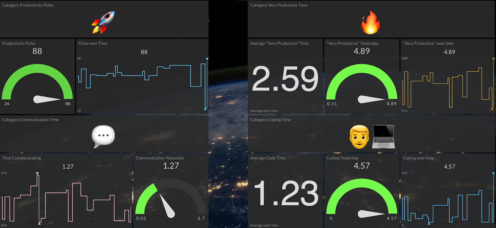

<link rel="apple-touch-icon" sizes="180x180" href="/apple-touch-icon.png">
<link rel="icon" type="image/png" sizes="32x32" href="/favicon-32x32.png">
<link rel="icon" type="image/png" sizes="16x16" href="/favicon-16x16.png">
<link rel="manifest" href="/site.webmanifest">

## Portfolio

---

### Professional 

[How to gain insight into your project contributors](https://github.blog/2024-01-25-do-you-know-if-all-your-repositories-have-up-to-date-dependencies/)

---

[How to gain insight into your project contributors](https://github.blog/2023-10-23-how-to-gain-insight-into-your-project-contributors/)

---

[Metrics for issues, pull requests, and discussions](https://github.blog/2023-07-19-metrics-for-issues-pull-requests-and-discussions/)

---

[A tool to help you keep your open source catalog organized and up to date](https://github.blog/2023-06-05-announcing-the-stale-repos-action/)

---

[An open source project to empower OSPOs everywhere](https://github.blog/2023-03-13-an-open-source-project-to-empower-ospos-everywhere/)

---

[Securing and delivering high-quality code with innersource metrics](https://github.blog/2022-05-18-securing-and-delivering-high-quality-code-with-innersource-metrics/)

---

[How to measure innersource across your organization](https://github.blog/2022-05-16-how-to-measure-innersource-across-your-organization/)

---

[Accelerate security adoption in your organization](https://github.blog/2021-11-22-accelerate-security-adoption-in-your-organization/)

---

[Launching an InnerSource Project Portal](/Launching-InnerSource-Portal)

---
[Self Building Jenkins CI Server](/self-building-jenkins)

---
[Launching an Open Source Office](/OSO-launch)

---
[Automated Branch Protection Web Service](https://github.com/zkoppert/Auto-branch-protect)

---
[Article on Productivity Dashboard for Devs](https://medium.com/initial-state/productivity-dashboard-for-devs-58eea6b2c59a)

---

### Personal

- [GitHub App - Comments on new issues](https://github.com/zkoppert/Carl-the-llama)
    - I used this project as an opportunity to learn CI with JavaScript, CD to AWS Lambda, project documentation and security scanning with semmle.
- [Article on Career Planning](https://medium.com/@zacheryk89/career-planning-in-tech-91b650457a59)

---

---

Page template forked from <a href="https://github.com/evanca/quick-portfolio">evanca</a>

<!-- Remove above link if you don't want to attibute -->
